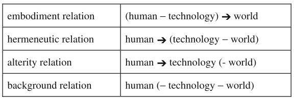
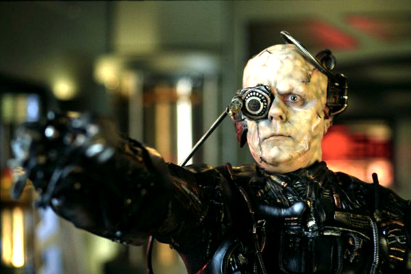
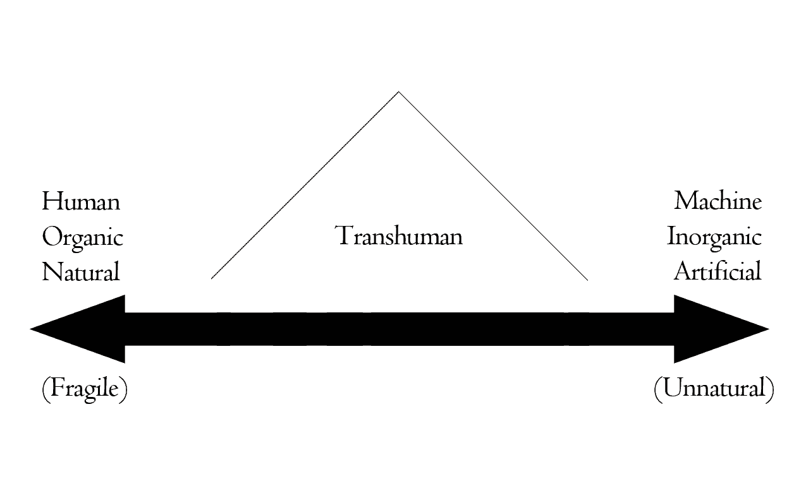

```{r presentationsetup, include=FALSE}
knitr::opts_chunk$set(echo = FALSE)
```

class: right, bottom, inverse

background-image: url(standby.png)
background-position: center
background-color: #000
background-size: contain

<!-- <br /><h3 style="album">Destroyer - Kaputt (2011)</h3> -->

---
layout: true

<div class="my-header"></div>
<div class="my-footer"><span>HNRS 195H: Cyborgs and Transhumanism</span></div> 


---
class: left, middle, inverse

# HNRS 195H: Cyborgs and Transhumanism

## Week 10

## Dr. Ryan Straight

---

## What is a cyborg?

--

"Cybernetic organism"

<div style="width:100%;height:0;padding-bottom:56%;position:relative;"><iframe src="https://giphy.com/embed/edyBJlwtogXxS" width="100%" height="100%" style="position:absolute" frameBorder="0" class="giphy-embed" allowFullScreen></iframe></div><p><a href="https://giphy.com/gifs/medicine-prosthetics-edyBJlwtogXxS">via GIPHY</a></p>

---

## Cybernetic

Cybernetic(s): The theoretical study of communication and control processes in biological, mechanical, and electronic systems, especially the comparison of these processes in biological and artificial systems.

---

## More definitions

A person whose physiological functioning is aided by or dependent upon a mechanical or electronic device

<div style="width:100%;height:0;padding-bottom:25%;position:relative;"><iframe src="https://giphy.com/embed/dwfLPqnIa0yzu" width="100%" height="100%" style="position:absolute" frameBorder="0" class="giphy-embed" allowFullScreen></iframe></div><p><a href="https://giphy.com/gifs/cheezburger-cybernetic-handshello-dwfLPqnIa0yzu">via GIPHY</a></p>

--

### Haraway
Non-naturalist human

--

### Verbeek
Border-blurring entity, uniting both human and nonhuman elements

---

## When did we become cyborgs?

+ Have we always been?

--

+ Stiegler: humanity is an invention of technology, not the other way around

<div style="width:100%;height:0;padding-bottom:56%;position:relative;"><iframe src="https://giphy.com/embed/y7Vdxx9BTDbeo" width="100%" height="100%" style="position:absolute" frameBorder="0" class="giphy-embed" allowFullScreen></iframe></div><p><a href="https://giphy.com/gifs/days-caveman-y7Vdxx9BTDbeo">via GIPHY</a></p>

???

So was Stiegler right? Good discussions in the O&Rs about this and it depends on how you define "humanness," right? It's pretty clear we can say that technology scaffolded our ability to grow as humans, both biologically and culturally through things like art and agriculture, but couldn't we equally say the harnessing of fire (remember Kline's definitions of technology?) is what led to our quote-unquote "humanity" and higher-order thinking because it provided us with warmth, made us want to take shelter because of that warmth, allowed us to cook foods and get the various nutrition that you can only get with cooked food? More interesting questions.

---

## Sorite's paradox

Where do we draw the line?

<div style="width:100%;height:0;padding-bottom:40%;position:relative;"><iframe src="https://giphy.com/embed/11ZZW6J4lyS26Q" width="100%" height="100%" style="position:absolute" frameBorder="0" class="giphy-embed" allowFullScreen></iframe></div><p><a href="https://giphy.com/gifs/maudit-maudit-so-pretty-lawrence-of-arabia-11ZZW6J4lyS26Q">via GIPHY</a></p>

???

Originates with the sand dune example: "The "heap" of sand. Remove one grain of sand, it's still a heap. Repeat until one grain is left. When did the heap change to a non-heap? Is that one grain a heap?"

The reverse is true: start with one grain of sand, and keep adding individual grains. When does it become a heap?

---

## Replacement?

+ Think about your computer
+ You've replaced every part
+ Is it the same computer?
+ The issue becomes **metaphysical**

---

## Example: The Doctor

But *is* it?

<div style="width:100%;height:0;padding-bottom:52%;position:relative;"><iframe src="https://giphy.com/embed/3o751Y2mQnH1lwDfVe" width="100%" height="100%" style="position:absolute" frameBorder="0" class="giphy-embed" allowFullScreen></iframe></div><p><a href="https://giphy.com/gifs/bbcamerica-doctor-who-twelfth-3o751Y2mQnH1lwDfVe">via GIPHY</a></p>

???

So, we might say that it's consciousness that determines the human, in this case, right? Maybe that's a good way of thinking about it.

If every cell in The Doctor's body regenerates (presumably meaning it changes into quote-unquote "new" cells, meaning *different* cells, but there's no lapse or change in consciousness, ie The Doctor retains all memroy) is it the same doctor?

How about the transporter in the Star Trek universe? If that person is atomized and reconstructed, is there a lapse in consciousness? Is it the same person after the transport? 

Here's a terrifying thought: what if that happens every time we go to sleep? If persistent consciousness is a definition for humanity, is "the person" we were when we went to sleep gone forever and we're just a new version with all the same memories? 

Interesting questions, huh?

---

## Neurorehabilitation

+ Child suffers injury and is essentially brain-dead.
+ New procedure: “neuroreconstruction”
+ \~6 months to grow “new” brain


--

**But**:


+ Child loses all memories, possibly will have different attitude/temperament
+ Needs re-educated like a newborn, will catch up with peers in ~4 years
+ Is it the same child?

---

## Cybernetic vision

+ Stem-cell repairs macular degeneration
+ What if cells were synthetic?
+ What if repaired via electrodes?
+ What if vision were replaced with artificial stimulation?

<div style="width:100%;height:0;padding-bottom:56%;position:relative;"><iframe src="https://giphy.com/embed/X9trzKpgRY1N1QsGim" width="100%" height="100%" style="position:absolute" frameBorder="0" class="giphy-embed" allowFullScreen></iframe></div><p><a href="https://giphy.com/gifs/cheese-stilton-picking-X9trzKpgRY1N1QsGim">via GIPHY</a></p>

---

## The question becomes: **when** do we care?

+ Augmented humans?
+ Non-human mode of relationship and reaction or response may affect a person at a deep and pervasive level
+ “That’s unnatural!”

<div style="width:100%;height:0;padding-bottom:50%;position:relative;"><iframe src="https://giphy.com/embed/1xNmjvYS9is47QDzQo?video=0" width="100%" height="100%" style="position:absolute" frameBorder="0" class="giphy-embed" allowFullScreen></iframe></div><p><a href="https://giphy.com/gifs/brain-look-around-you-ebe-1xNmjvYS9is47QDzQo">via GIPHY</a></p>

---

## What's "worse"

+ Biological human augmented beyond "human" recognition
+ AI with no corporeal form
+ Replicants

<div style="width:100%;height:0;padding-bottom:53%;position:relative;"><iframe src="https://giphy.com/embed/14lyvFbEx5ByNi" width="100%" height="100%" style="position:absolute" frameBorder="0" class="giphy-embed" allowFullScreen></iframe></div><p><a href="https://giphy.com/gifs/blade-runner-ridley-scott-14lyvFbEx5ByNi">via GIPHY</a></p>

---

## A Return to Postphenomenology

There is a relation between the subject and the object that comes about mediated by technology. Technology is a medium which mutually constitutes the subject and the object.

--

+ Intentionality: makes visible the "inextricable connections" between humans and the world

---

## Cyborg intentionality

+ **Mediated** intentionality
+ Remember the relations?

--



---

## **Mediated** intentionality

+ Except *alterity*, human intentionality is **mediated** by technology
+ Binoculars, thermometers, A/C, etc.

---

## *Hybrid* intentionality

+ When intentionality goes **both** ways, or...
+ when they **merge**

---

## Posthuman

## vs

## Transhuman

???

The major difference between the two is that Posthumanism puts a lot of emphasis on systems and their components, while transhumanism fully focuses on changing the form and abilities of the present human body. Another difference is that posthumans place importance on information and system theories (cybernetics) and their main relationship is with digital technology, while this is not the same for transhumans.

The difference is right there in the prefixes: post (after) vs trans (meaning across, beyond).

---

## Posthuman

+ Consider human-technology relations when thinking about what it means to be human
+ Moves beyond “humanism”

???

Posthumanism is traversing the current human condition to eliminate the things that are considered human nature. In other words, a post human state is where humans and genius machines are completely integrated so that it’s difficult to discern what’s human. According to posthuman transcribers, the post human project will change the current perspective of everything considered human, as information patterns that are limiting the potential of humans will all be unlocked. The focus of Posthumanism is therefore on function as opposed to form.

--



???

...

There's a position called "speculative posthumanism" that postulates the decendents of current humans could cease to be "human" by virtue of a history of technical alteration. (Roden, 2010). And this is when we get into metaphysics vs ethics. 

It's possible that the lives these posthumans live are so far removed from our current experience of the world that we can't even fathom them. So, if this is the case, it begs the question as to why we'd think current ethical norms regarding personal autonomy--good vs evil--could even apply to them.

Case in point: the Borg.

---

## Transhuman

+ Deals more with the physical fusion of human and technology
+ Moves beyond "human"

???

Transhumanism, on the other hand, refers to physically transforming humans with any new technology, including bioengineering, digital technology, genetic engineering and others, to enhance their abilities; for example, making them more intelligent, stronger, immortal, and so on. In a conventional way, transhumanism can be classified as a sub-class of posthumanism. Transumanists are already using certain implants to modify their bodies for enhanced senses or brain power, so the focus is now on using prosthetics and other accessories or modifications as opposed to compensating for human abilities.

--



???

Transhumanism is a measure of degree, which is our concern now. It is not simply a binary distinction; it is not true that either one is transhuman or one is not. (The future social implications of that should also be considered with great concern.) There is a continuum that runs between the human and the machine, the organic and the inorganic, the natural and the artificial. Anywhere between these extremes rests the transhuman.

Is there a tipping point? Beyond being a source of potential social strife and stratification, the qustion of identity arises. Already we know that the abject comes from the other in a biological sense (severed limbs, vomit, etc). Were one's identity beyond that imaginary tipping point, does one associate with the artificial more? Does the abject transfer to nuts and bolts rather than fingernail clippings and stray hairs?

Language in this vein is important. (Natural/fragile and artificial/unnatural.) If natural is valued, unnatural becomes disparaging and the dominant term rather than artificial. If the quality of augmentation is valued, maybe flesh bags (100% organic humans) could be the target of abuse. Language changes and hegemony changes with it.

Beyond replacement of organs (like prosthetic eyes) there is augmenting the brain with machine/brain interfaces. Both fantastic and potentially life-changing, the idea of using machines to not improve our strength, perception or senses, but our cognitive ability alone changes the paradigm of knowledge and learning. It also once again blurs the line between man and machine on the most fundamental level in a very different realm from the physical change.

---

## Composite relation

+ Related to **hermenutic**
+ Double intentionality:
  + technology toward **its** world
  + us toward the result
  
<div style="width:100%;height:0;padding-bottom:40%;position:relative;"><iframe src="https://giphy.com/embed/cVRV2RVEaM8Fi" width="100%" height="100%" style="position:absolute" frameBorder="0" class="giphy-embed" allowFullScreen></iframe></div><p><a href="https://giphy.com/gifs/blade-runner-cVRV2RVEaM8Fi">via GIPHY</a></p>
  
---

## Hermenutic

human -> (technology - world)

## Composite

human -> (technology -> world)

--

Examples?

???

+ Radio telescopes
+ IR cameras

---


???

This is an infrared photograph of a cemetery. It makes visible to our eyes what only the technology can "see."

---

## Alteration relation

+ Self-reflexive
+ Technology can alter the world.
+ I -> technology -> I

???

Growing organs on chips, testing sperm at home, selecting sex.